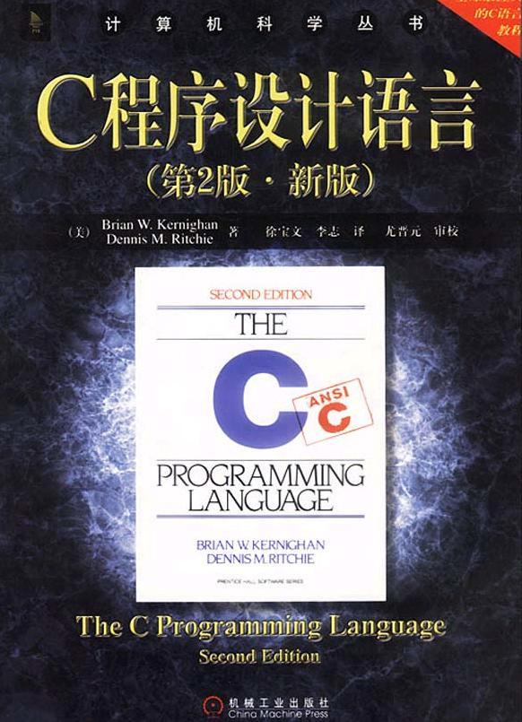
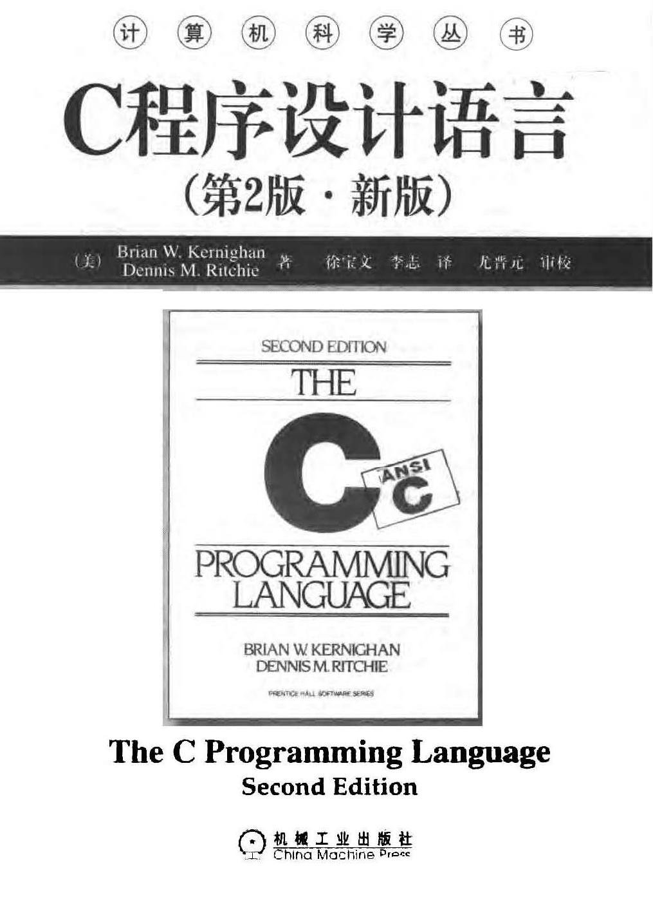

本书是由 C语言的设计者 Brian W. Kernighan和 Dennis M. Ritchie编写的一部介绍标准 C语言及其程序设计方法的权威性经典著作。全面、系统地讲述了 C语言的各个特性及程序设计的基本方法，包括基本概念、类型和表达式、控制流、函数与程序结构、指针与数组、结构、输入与输出、UNlX 系统接口、标准库等内容。本书的讲述深入浅出，配合典型例证，通俗易懂，实用性强，适合作为大专院校计算机专业或非计算机专业的 C语言教材，也可以作为从事计算机相关软硬件开发的技术人员的参考书。

Authorized translation from the English language edition entitled The C Programming Language, Second Edition, ISBN: 0-13-110362-8 by Brian W. Kernighan and Dennis M. Ritchie,published hy Pearson Education, Inc, publishing as Prentice Hall PTR, Copyright © 1988, 1978 by Bell Telephone Laboratories, Incorporated.

All rights reserved. No part of this book may be reproduced or transmitted in any form or by any means, electronic or mechanic, including photocopying, recording, or by any information storage retrieval system, without permisson of Pearson Education, Inc.

CHNESE SIMPLIFIED language edition published by China Machine Press.Copyright © 2004 by China Machine Press.

本书中文简体字版由美国 Pearson Edecation 培生教育出版集团授权机械工业出版社独家出版。未经出版者书面许可，不得以任何方式复制或抄袭本书内容。

版权所有，侵权必究。

本书版权登记号：图字：01-1999-2347

图书在版编目（CIP）数据

C 程序设语言／（美）克尼汉（Kernighan, B. W.）（美）里奇（Ritchie, D. M.）著；徐宝文，李志译，2版— 北京：机诫工业出版社，2004.1

（计算机科学丛书）书名原文：The C Programming Language ISBN 7-111-12806-0

I. C…  Ⅱ . ①克 …  ②里 …  ③徐 …  ④李 …  Ⅲ . C语言— 程序设计  Ⅳ . TP312

中国版本同书馆 CIP数据核字（2003）第 092753号

机械工业出版社（北京市西城区百万庄大街 22号 邮政编码 100037）责任编辑：温莉芳北京瑞德印刷有限公司印刷•新华书店北京发行所发行2004年 1月第 2版•2004年 3月第 3次印刷787mm ×1092mm 1/16•17.5印张印数：8001-11000册定价：30.00元凡购本书，如有倒页、脱页、缺页，由本社发行部调换本社购书热线电话：（010）68326294

# 出版者的话

文艺复兴以降，源远流长的科学精神和逐步形成的学术规范，使西方国家在自然科学的各个领域取得了垄断性的优势；也正是这样的传统，使美国在信息技术发展的六十多年间名家辈出、独领风骚。在商业化的进程中，美国的产业界与教育界越来越紧密地结合，计算机学科中的许多泰山北斗同时身处科研和教学的最前线，由此而产生的经典科学著作，不仅擘划了研究的范畴，还揭橥了学术的源变，既遵循学术规范，又自有学者个性，其价值并不会因年月的流逝而减退。

近年，在全球信息化大潮的推动下，我国的计算机产业发展迅猛，对专业人才的需求日益迫切。这对计算机教育界和出版界都既是机遇，也是挑战；而专业教材的建设在教育战略上显得举足轻重。在我国信息技术发展时间较短、从业人员较少的现状下，美国等发达国家在其计算机科学发展的几十年间积淀的经典教材仍有许多值得借鉴之处。因此，引进一批国外优秀计算机教材将对我同计算机教育事业的发展起积极的推动作用，也是与世界接轨、建设真正的世界一流大学的必由之路。

机械工业出版社华章图文信息有限公司较早意识到“出版要为教育服务”。自1998年开始，华章公司就将工作重点放在遴选、移译国外优秀教材上。经过几年的不懈努力，我们与 Prentice Hall，Addison-Wesley，McGraw-Hill，Morgan Kaufmann等世界著名出版公司建立了良好的合作关系，从它们现有的数百种教材中甄选出 Tanenbaum，Stroustrup，Kerhighan，Jim Gray 等大师名家的一批经典作品，以“计算机科学丛书”为总称出版，供读者学习、研究及广支藏。大理石纹理的封面，也正体现了这套从书的品位和格调。

“计算机科学丛书”的出版工作得到了国内外学者的鼎力襄助，国内的专家不仅提供了中肯的选题指导，还不辞劳苦地担任了翻译和审校的工作；而原书的作者也相当关注其作品在中国的传播，有的还专诚为其书的中译本作序。迄今，“计算机科学丛书”已经出版了近百个品种，这些书籍在读者中树立了良好的口碑，并被许多高校采用为正式教材和参考书籍，为进一步推广与发展打下了坚实的基础。

随着学科建设的初步完善和教材改革的逐渐深化，教育界对国外计算机教材的需求和应用都步入一个新的阶段。为此，华章公司将加大引进教材的力度，在“华章教育”的总规划之下出版三个系列的计算机教材；除“计算机科学丛书”之外，对影印版的教材，则单独开辟出“经典原版书库”；同时，引进全美通行的教学辅导书“Schaum’s Outlines”系列组成“全美经典学习指导系列”。为了保证这三套丛书的权威性，同时也为了更好地为学校和老师们服务，华章公司聘请了中国科学院、北京大学、清华大学、国防科技大学、复旦大学、上海交通大学、南京大学、浙江大学、中国科技大学、哈尔滨工业大学、西安交通大学、中国人民大学、北京航空航天大学、北京邮电大学、中山大学、解放军理工大学、郑州大学、湖北工学院、中国国家信息安全测评认证中心等国内重点大学和科研机构在计算机的各个领域的著名学者组成“专家指导委员会”，为我们提供选题意见和出版监督。

这三套丛书是响应教育部提出的使用外版教材的号召，为国内高校的计算机及相关专业的教学度身订造的。其中许多教材均已为 M.I.T.，Stanford，U.C. Berkeley，C.M.U.等世界名牌大学所采用。不仅涵盖了程序设计、数据结构、操作系统、计算机体系结构、数据库、编译原理、软件工程、图形学、通信与网络、离散数学等国内大学计算机专业普遍开设的核心课程，而且各具特色—— 有的出自语言设计者之手、有的历经三十年而不衰、有的已被全世界的几百所高校采用。在这些圆熟通博的名师大作的指引之下，读者必将在计算机科学的宫殿中由登堂而入室。

权威的作者、经典的教材、一流的译者、严格的审校、精细的编辑，这些因素使我们的图书有了质量的保证，但我们的目标是尽善尽美，而反馈的意见正是我们达到这一终极目标的重要帮助。教材的出版只是我们的后续服务的起点。华章公司欢迎老师和读者对我们的工作提出建议或给予指正，我们的联系方法如下：

电子邮件：hzedu@hzbook.com

联系电话：（010）68995264

联系地址：北京市西城区百万庄南街 1号

邮政编码：100037专家指导委员会

（按姓氏笔画顺序）

```
尤晋元       王珊         冯博琴       史忠植       史美林
石教英       吕建         孙玉芳       吴世忠       吴时霖
张立昂       李伟琴       李师贤       李建中       杨冬青
邵维忠       陆丽娜       陆鑫达       陈向群       周伯生
周克定       周傲英       孟小峰       岳丽华       范  明
郑国梁       施伯乐       钟玉琢       唐世渭       袁崇义
高传善       梅宏         程旭         程时端       谢希仁
裘宗         戴葵
```

# 中文版序

Preface to the Chinease Edition

Since its original design and implementation by Dennis Ritchie in 1973, the C programming language has spread fat beyond its origins at Bell Labs. It has become the common language for programmers throughout the world, and has given birth to two other major languages, C++ and Java,that build on its syntax and basic structure. C and its derivatives are the base upon which much of the world’s software rests.

The spread of C required actionto describe the language itself completely, and to accommodate changes in the way it was being used. In 1988, the American National Standards Institute (ANSI) created a precise standard for C that preserved its expressiveness, efficiency, small size, and ultimate control over the machine, while at the same time providing assurance that programs conforming to the standard would be portable without change from one computer and operating system to another.This standard was also accepted as an international standard under the auspices of the International Standards Organization (ISO), and thus brought the benefits of standardization to a worldwide user community.

The standards committee was aware of the multi-national use of the C language, and thus provided, both in the language itself and in the library, support for “wide characters”, which are needed to represent text in Chinese as well as other languages that do not use the Roman character set.

In spite of these evolutionary changes, C remains as it was from its inception, a compact and efficient tool for programmers of all backgrounds.

The C language, and also the Unix technology from which it grew, have been present in China for many years，as we know from visits to universities and the Chinese Academy of Sciences.Students’ learning has always been made more difficult by the lack of an authoritativ translation of the material describing this work into a form convenient for study in China. We are delighted that Professor Xu has made this Chinese translation of “The C programming Language” available so that C will be more readily accessible to our colleagues in the People’s Republic of China.

Brian W. Kernighan

Dennis M. Ritchie中文版序

C 程序设计语言最早是由 Dennis Ritchie于 1973年设计并实现的。从那时开始，C 语言已经从其位于贝尔室验室的发源地传播到世界各地。它已经成为全球程序员的公共语言。并由此诞生了两个新的主流语言 C++与 Java—— 它们都建立在 C语言的语法扣基本结构的基础上。现在世界上的许多软件都是在 C语言及其衍生的各种语言的基础上开发出来的。

C 语言的传播需要我们对语言加以完整的描连，并适应它在使用过程中所进行的一些变化。1988年，美国国家标准协会（ANSI）为 C语言指定了一个精确的标准，该标准保持了 C的表达能力、效率、小规模以及对机器的最终控制，同时还保证符合标准的程序可以从一种计算机与操作系统移植到另一种计算机与操作系统而无需改变。这个标准同时也被国际标准化组织（ISO）接受为国际标准，使世界各地的用户团体部受益于这一标准。

标准委员会考虑到 C语言在多民族使用的情况，在语言本身以及库中都提供了对“宽字符”的支特，这是以中文以及其他不使用罗马字符集的话言来表示主文所需要的。

除了这些渐进的变化外，C 仍保持着它原来的样子—— 具有各种背景的程序员的一种紧凑而有效的工具。

在我们访问中国的大学和中国科学院时，我们获悉，C 语言以及基于它发展起来的 UNIX技术引入中国已经有很事年了，由于缺少把描述这一工作的素材翻译成在中国易于学习的形式的权威译本，学生们在学习时遇到了许多固难。我们欣喜地看到徐宝文教授完成《C 程序设计语言》的中译本，我们希望它的出版有助于我们在中华人民共和国的同行更客易地理解 C语言。

Brian W. Kernighan

Dennis M. Ritchie

# 译者序

《The C Programming language》不仅在 C与 C++语言界，而且在整个程序设计语言教学与研究界都是耳熟能详的经典著作。最主要的两点原因是：

其一，这部著作自第 l版问世后就一直深受广大读者欢迎，畅销不衰，是计算机学术界与教育界著书立说的重要参考文献。可以说，几乎所有的程序设计语言著作以及 C与 C++著作的作者都把这部著作作为参考文献。早在 20年前我国就翻译出版过这部著作的第 1版。

其二，这部著作的原作者之一 Dennis M. Ritchie 是 C语言的设计者，这样就保证了在著作中能完整、准确地体现与描述 C语言的设计思想。本书讲述的程序设计方法以及各种语言成分的细节与用法具有权威性，这很有利于读者把握 C语言的精髓。

《The C Programming Language》的第 1版问世于 1978年，第 2版自 1988年面世后一直被广泛使用，至今仍未有新的版本出版，由此可见该著作内容的稳定性。

本书英文原著叙述深入浅出、条理清楚，加之辅以丰富的例证，非常通俗易懂。无论对于计算机专业人员还是非计算机专业人员，也无论用于 C语言教学还是用作参考书，她都是当之无愧的正确选择。这也许就是这部著作自第 1版问世以来长期畅销不衰的原因之一。

机械工业出版社曾经于 2000年出版过中文版。众多高校师生在使用进程中提出了大量的宝贵意见，出版社和我们悉心听取并总结了这些意见，更加深入地领会了原书的要旨，重新认真精读了原书中的每句话，在此基础上，我们推出了新版中文版。此新版中文版在语言、术语标准化、技术细节等方面都对原中文版本进行了要进一步的雕琢。希望本书能够更好地帮助您学习 C语言！

本书由东南大学计算机系徐宝文教授和上海交通大学计算机系李志博士翻译，上海交通大学计算机系的尤晋元教授审校了全书内容。在本书出版之际，我们感谢所有曾经给予我们帮助的人们！

本书的原著是经典的 C语言教材，我们在翻译本书的过程中，无时无刻不感觉如覆薄冰，惟恐因为才疏学浅，无法正确再现原著的风范，因此，我们一直在努力做好每件事情。但是，无论如何尽力，错谈和疏漏在所难免，敬请广大读音批评指正。我们的邮件地址是：lizhi_mail@263.net。随时欢迎您的每一点意见。如果您在阅读中遇到问题，或者遇到 C语言的技术问题，可随时与我们联系，我们将尽力提供帮助。最后，感谢关心本书成长的每一位读者！

译者

2003年 6月校译者简介

译者简介

徐宝文，东南大学计算机科学与工程系教授，博士生导师，江苏省政协常委，江苏省计算机学会副理事长，江苏省软件行业协会副会长，中国计算机学会理事，中国软件行业协会理事。主要从事程序设计语言、软件工程等方面的教学与研完工作，负责承担过十多项国家级、部省级科研项目；在国内外发表论文 130多篇，出版著译作 10多部；担任《实用软件详解丛书》与《新世纪计算机系列教材》的主编，第五次国际青年计算机学术会议（ICYCS ’99）大会主席；发起并主办过两次“全国程序设计语言发展与教学学术会议”；先后获航空航天部优秀青年教师、江苏省优秀教育工作者、江苏省优秀青年骨干教师、江苏省跨世纪学术带头人等称号。

李志，毕业于国防科技大学计算机学院，现于上海交通大学计算机科学与工程系攻读博士学位，主要从事网格计算、中间件技术等方面的研究。已经出版的译作有《IP 技术基础：编址和路由》、《ISDN 与 Cisco路由器配置》等。

审校人简介

尤晋元，上海交通大学计算机科学与工程系教授、博士生导师、国务院学位委员会学科评议组成员、主要从事操作系统、分布对象计算、中间件技术等方面的研究并长期担任操作系统及分布计算等课程的教学工作。主编和翻译了多本与操作系统相关的教材和参考书，包括《UNIX 操作系统教程》、《UNIX 环境高级编程》、《操作系统设计与实现》等。

# 序

自从 1978年《The C Programming Language》一书出版以来，计算机领域经历了一场革命。大型计算机的功能越来越强大，而个人计算机的性能也可以与十多年前的大型机相媲美。在此期间，C 语言也在悄悄地演进，其发展早己超出了它仅仅作为 UNIX 操作系统的编程语言的研衷。

C 语言普及程度的逐渐增加以及该语言本身的发展，加之很多组织开发出了与其设计有所不同的编译器，所有这一切都要求对 C语言有一个比本书第 1版更精确、更适应其发展的定义。1983 年，美国国家标准协会（ANSI）成立了一个委员会，其目标是制定“一个无歧义性的且与具体机器无关的 C语言定义”，而同时又要保持 C语言原有的“精神”。结果产生了 C语言的 ANSI标准。

ANSI 标准规范了一些在本书第 1版中提及但没有具体描述的结构，特别是结构赋值和枚举。该标准还提供了一种新的函数声明形式，允许在使用过程中对函数的定义进行交叉检查。标准中还详细说明了一个具有标准输入／输出、内存管理和字符串操作等扩展函数集的标准库。它精确地说明了在 C语言原始定义中并不明晰的某些特性的行为，同时还明确了 C语言中与具体机器相关的一些特性。

本书第 2版介绍的是 ANSI标准定义的 C语言。尽管我们已经注意到了该语言中已经变化了的地方，但我们还是决定在这里只列出它们的新形式。最重要的原因是，新旧形式之间并没有太大的差别；最明显的变化是函数的声明和定义。目前的编译器已经能够支持该标准的大部分特性。

我们将尽力保持本书第 1版的简洁性。C 语言并不是一种大型语言，也不需要用一本很厚的书来描述。我们在讲解一些关键特性（比如指针）时做了改进，它是 C语言程序设计的核心。我们重新对以前的例子进行了精炼，并在某些章节中增加了一些新例子。例如，我们通过实例程序时复杂的声明进行处理，以将复杂的声明转换为描述性的说明或反之。像前一版中的例子一样，本版中所有例子都以可被机器读取的文本形式直接通过了测试。

附录 A只是一个参考手册，而非标准，我们希望通过较少的篇幅概述标准中的要点。该附录的目的是帮助程序员更好地理解语言本身，而不是为编译器的实现者提供一个精确的定义—— 这正是语言标准所应当扮演的角色。附录 B对标准库提供的功能进行了总结，它同样是面向程序员而非编译器实现者的。附录 C对 ANSI标准相对于以前版本所做的变更进行了小结。

我们在第 1版中曾说过：“随着使用经验的增加，使用者会越来越感到得心应手”。经过十几年的实践，我们仍然这么认为。我们希望这本书能够帮助读者学好并用好 C语言。

非常感谢帮助我们完成本书的朋友们。Jon Bentley、Doug Gwyn 、Doug McIlroy、Peter Nelson和 Rob Pike 几乎对本书手稿的每一页都提出了建议。我们非常感谢 Al Aho、Dennis Allison、Joe Campbell、G. R. Emlin、Karen Fortgang、Allen Holub、Andrew Hume 、Dave Kristol、John Linderman、Dave Prosser、Gene Spafford和 Chris Van Wyk等人，他们仔细阅读了本书。我们也收到了来自 Bill Cheswick、Mark Kernighan、Andy Koenig、Robin Lake、Tom London、Jim Reeds、Clovis Tondo和 Peter Weiberger等人很好的建议。Dave Prosse为我们回答了很多关于 ANSI标准的细节问题，我们大量地使用了 Bjarne stroustrup的 C++翻译程序进行程序的局部测试。Dave Kristol为我们提供了一个 ANSI C编译器以进行最终的测试。Rich Drechsler帮助我们进行了大量的排版工作

真诚地感谢每个人！

Brian W. Kernighan

# 第一版序

第 1版序

C 语言是一种通用的程序设计语言，其特点包括简洁的表达式、流行的控制流和数据结构、丰富的运算符集等。C 语言不是一种“很高级”的语言，也不“庞大”，并且不专用于某一个特定的应用领域。但是，C 语言的限制少，通用性强，这使得它比一些公认为功能强大的语言使用更方便、效率更高。

C 语言最初是由 Dennis Ritchie为 UNIX 操作系统设计的，并在 DEC PDP-11 计算机上实现。UNIX 操作系统、C 编译器和几乎所有的 UNIX 应用程序（包括编写本书时用到的所有软件）都是用 C话言编写的。同时，还有一些适用于其它机器的编译器产品，比如 IBM System/370、Honeywell 6000和 Interdata 8/32等。但是，C 语言不受限于任何特定的机器或系统，使用它可以很容易地编写出不经修改就可以运行在所有支持 C语言的机器上的程序。

本书的目的是帮助读者学习如何用 C语言编写程序。本书的开头有一个指南性的引言，目的是使新用户能尽快地开始学习；随后蕾不同的章节中介绍了 C语言的各种主要特性；本书的附录中还包括一份参考手册。本书并不仅仅只是讲述语言的一些规别，而是采用阅读别人的代码、自己编写代码、修改某些代码等不同的方式来指导读者进行学习。书中的大部分例子都可以直接完整地运行，而不只是孤立的程序段。所有例子的文本都以可被机器读取的文本形式直接通过了测试。除了演示如何有效地使用语言外，我们还尽可能地在适当的时候向读者介绍一些高效的算法、良好的程序设计风格以及正确的设计原则。

本书并不是一本有关程序设计的入门性手册，它要求读者熟悉基本的程序设计概念，如变量、赋值语句、循环和函数等尽管如此，初级的程序员仍能够阅读本书，并借此学会 C语言。当然，知识越丰富，学习起来就越容易。

根据我们的经验，C 语言是一种令人愉快的、具有根强表达能力的通用的语言，适合于编写各种程序。它容易学习，并且随着使用经验的增加，使用者会越来越感到得心应手。我们希望本书能帮助读者用好 C语言。

来自许多朋友和同事的中肯批评和建议对本书的帮助很大，也使我们在写作本书过程中受益匪浅。在此特剐别感谢 Mike Bianchi、Jim Blue、Sut Feldman、Doug McIlroy、Bill Room、Bob Rosin和 Larry Rosler等人，他们细心地阅读了本书的多次修改版本。我们在这里还要感谢 Al Aho、Steve Bourne、Dan Dvorak、Chuck Haley、Debbie Haley、Marion Harris、Rick Holt、Steve Johnson、John Mashey、Bob Mitze、Ralph Muha、Peter Nelson、Elliot Pinson、Bill Plauger、Jerry Spivack、Ken Thompson 和 Peter Weinberger等人，他们在不同阶段提出了非常有益的意见，此外还要感谢 Mike Lesk和 Joe Ossanna，他们在排版方面给予了我们很宝贵的帮助。

Brian W. Kernighan

Dennis M. Ritchie

# 引言

C 语言是一种通用的程序设计语言。它同 UNIX 系统之间具有非常密切的联系—— C 语言是在 UNIX 系统上开发的，并且，无论是 UNIX 系统本身还是其上运行的大部分程序，都是用 C语言编写的。但是，C 语言并不受限于任何一种操作系统或机器。由于它很适合用来编写编译器和操作系统，因此被称为“系统编程语言”，但它同样适合于编写不同领城中的大多数程序。

C 语言的很多重要概念来源于由 Martin Richards开发的 BCPL 语言。BCPL 对 C语言的影响间接地来自于 B语言，它是 Ken Thompson为第一个 UNIX 系统而于 1970年在 DEC PDP-7计算机上开发的。

BCPL 和 B语言都是“无类型”的语言。相比较而言，C 语言提供了很多数据类型。其基本类型包括字符、具有多种长度的整型和浮点数等。另外，还有通过指针、数组、结构和联合派生的各种数据类型。表达式由运算符和操作数组成任何一个表达式，包括赋值表达式或函数调用表达式，都可以是一个语句。指针提供了与具体机器无关的地址算术运算。

C 语言为实现结构良好的程序提供了基本的控制流结构：语句组、条件判断（if-else）、多路选择（switch）、终止测试在顶部的循环（while、for）、终止测试在底部的循环（do）、提前跳出循环（break）等。

函数可以返回基本类型、结构、联合或指针类型的值。任何函数都可以递归调用。局部变量通常是“自动的”，即在每次函数调用时重新创建。函数定义可以不是嵌套的，但可以用块结构的方式声明变量。一个 C语言程序的不同函数可以出现在多个单独编译的不同源文件中。变量可以只在函数内部有效，也可以在函数外部但仅在一个源文件中有效，还可以在整个程序中都有效。

编译的预处理阶段将对程序文本进行宏替换、包含其它源文件以及进行条件编译。

C 语言是一种相对“低级”的语言。这种说法并没有什么贬义，它仅仅意味着 C语言可以处理大部分计算机能够处理的对象，比如字符、数字和地址。这些对象可以通过具体机器实现的算术运算符和逻辑运算符组合在一起并移动。

C 语言不提供直接处理诸如字符串、集台、列表或数组等复合对象的操作。虽然可以将整个结构作为一个单元进行拷贝，但 C语言没有处理整个数组或字符串的操。除了由函数的局部变量提供的静态定义和堆栈外，C 语言没有定义任何存储器分配工具，也不提供堆和无用内存回收工具。最后，C 语言本身没有提供输入／输出功能，没有 READ 或 WRITE 语句，也没有内置的文件访问方法，所有这些高层的机制必须由显式调用的函数提供。C 语言的大部分实现已合理地包含了这些函数的标准集合。

类似地，C 语言只提供简单的单线程控制流，即测试、循环、分组和子程序，它不提供多道程序设计、并行操作、同步和协同例程。

尽管缺少其中的某些特性看起来好像是一个严重不（“这意味着必须通过调用函数来比较两个字符串吗？”），但是把语言保持在一个适度的规模会有很多益处。由于 C语言相对较小，因此可以用比较小的篇幅将它描述出来，这样也很容易学会。程序员有理由期望了解、理解并真正彻底地使用完整的语言。

很多年来，C 语言的定义就是《The C Programming Language》第1版中的参考手册。1983年，美国国家标准协会（ANSI）成立了一个委员会以制定一个现代的、全面的 C语言定义。最后的结果就是 1988年完成的 ANSI标准，即“ANSI C ”。该标准的大部分特性已被当前的编译器所支持。

这个标准是基于以前的参考手册制定的，语言本身只做了相对较少的改动。这个标准的目的之一就是确保现有的程序仍然有效，或者当程序无效时，编译器会对新的定义发出警告信息。

对大部分程序员来说，最重要的变化是函数声明和函数定义的新语法。现在，函数声明中可以包含描述函数实际参数的信息；相应地，定义的语法也做了改变。这些附加的信息使编译器很容易检测到因参数不匹配而导致的错误。根据我们的经验，这个扩充对语言非常有用。

新标准还对语言做了一些细微的改进：将广泛使用的结构赋值和杖举定义为语言的正式组成部分；可以进行单精度的浮点运算；明确定义了算术运算的属性，特别是无符号类型的运算；对预处理器进行了更详尽的说明。这些改进对大多数程序员的影响比较小。

该标准的第二个重要贡献是为 C语言定义了一个函数库。它描述了诸如访问操作系统（如读写主件）、格式化输入／输出、内存分配和字符串操作等类似的很多函数。该标准还定义了一系列的标准头主件，它们为访问函数声明和数据类型声明提供了统一的方法。这就确保了使用这个函数库与宿主系统进行交互时程序之间具有兼容的行为。该函数库很大程度上与UNIX 系统的“标准 I/O库”相似。这个函数库已在本书的第 1版中进行了描述，很多系统中都使用了它，这一点对大部分程序员来说，不会感觉到有很大的变化。

由于大多数计算机本身就直接支持 C语言提供的数据类型和控制结构，因此只需要一个很小的运行时库就可以实现自包含程序。由于程序只能够显式地调用标准库中的函数，因此在不需要的情况下就可以避免对这些函数的调用。除了其中隐藏的一些操作系统细节外，大部分库函数可以用 C语言编写，并可以移植。

尽管 C语言能够运行在大部分的计算机上，但它同具体的机器结构无关。只要稍加用心就可以编写出可移植的程序，即可以不加修改地远行于多种硬件上。ANSI 标准明确地提出了可移植性问题，并预设了一个常量的集合，借以描述运行程序的机器的特性。

C 语言不是一种强类型的语言，但随着它的发展，其类型检查机制已经得到了加强。尽管C 语言的最初定义不赞成在指针和整型变量之间交换值，但并没有禁止，不过现在已经不允许这种做法了。ANSI 标准要求对变量进行正确的声明和显式的强制类型转换，这在某些较完善的编译器中已经得到了实现。新的函数声明方式是另一个得到改进的地方：编译器将对大部分的数据类型错误发出警告，并且不自动执行不兼容数据类型之间的类型转换。不过，C 语言保持了其初始的设计思想，即程序员了解他们在做什么，惟一的要求是程序员要明确地表达他们的意图。

同任何其它语言一样，C 语言也有不完美的地方。某些运算符的优先级是不正确的；语法的某些部分可以进一步优化。尽管如此，对于大量的程序设计应用来说，C 语言是一种公认的非常高效的、表示能力很强的语言。

本书是按照下列结构编排的：第 1章将对 C语言的核心部分进行简要介绍。其目的是让读者能尽快开始编写 C语言程序，因为我们深信，实际编写程序才是学习一种新语言的好方法。这部分内客的介绍假定读者对程序设计的基本元素有一定的了解。我们在这部分内容中没有解释计算机、编译等概念，也没有解释诸如 n = n + 2 这样的表达式。我们将尽量在合适的地方介绍一些实用的程序设计技术，但是，本书的中心目的并不是介绍教据结构和算法。在篇幅有限的情况下，我们将专注于讲解语言本身。

第 2章到第 6章将更详细地讨论 C语言的各种特性，所采用的方式将比第 l章更加形式化一些。其中的重点将放在一些完整的程序例子上，而并不仅仅只是一些孤立的程序段。第 2章介绍基本的数据类型、运算符和表达式。第 3章介绍控制流，如 if-else、switch、while和 for等。第 4 章介绍函数和程序结构—— 外部变量、作用域规则和多源文件等，同时还会讲述一些预处理器的知识。第 5章介绍指针和地址运算。第 6章介绍结构和联合。

第 7章介绍标准库。标准库提供了一个与操作系统交互的公用接口。这个函数库是由 ANSI标准定义的，这就意味着所有支持 C语言的机器都会支持它，因此，使用这个库执行输入／输出或其它访问操作系统的操作的程序可以不加修改地运行在不同机器上。

第 8章介绍 C语言程序和 UNIX 操作系统之间的接口，我们将把重点放在输入／输出、文件系统和存储分配上。尽管本章中的某些内容是针对 UNIX 系统所写的，但是使用其它系统的程序员仍然会从中获益，比如深入了解如何实现标准库以及有关可移植性方面的一些建议。

附录 A是一个语言参考手册。虽然 C语言的语法和语义的官方正式定义是 ANSI标准本身，但是，ANSI 标准的文档首先是写给编译器的编写者看的，因此，对程序员来说不一定最合适。本书中的参考手册采用了一种不很严格的形式，更简洁地对 C语言的定义进行了介绍。附录 B是对标准库的一个总结，它同样是为程序员而非编译器实现者准备的。附录 C对标准C 语言相对最初的 C语言版本所做的变更做了一个简短的小结。但是，如果有不一致或疑问的地方，标准本身和各个特定的编译器则是解释语言的最终权威。本书的最后提供了本书的索引。
